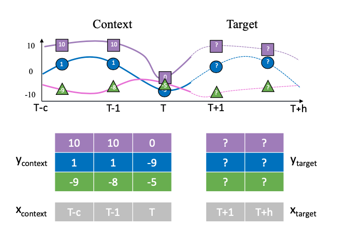
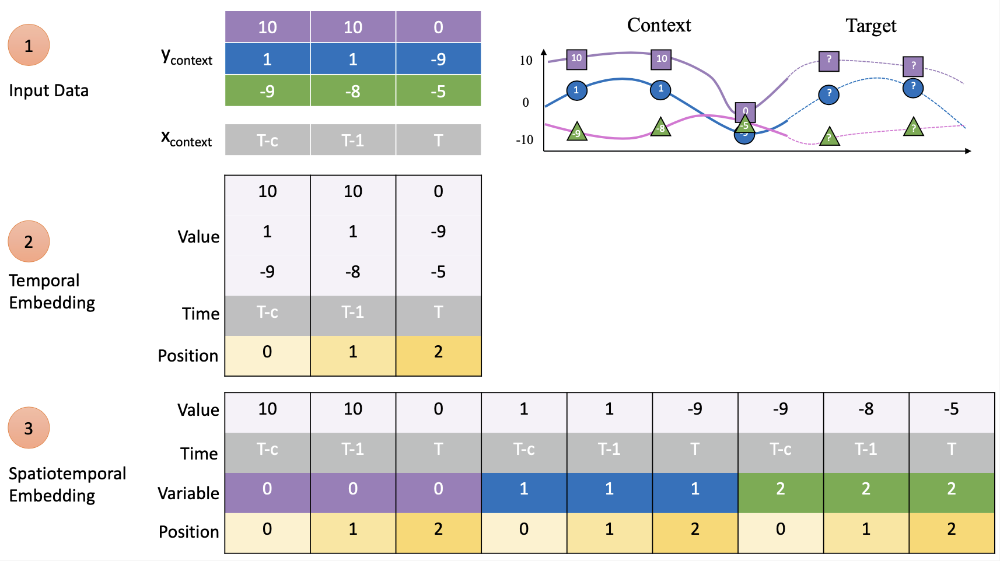
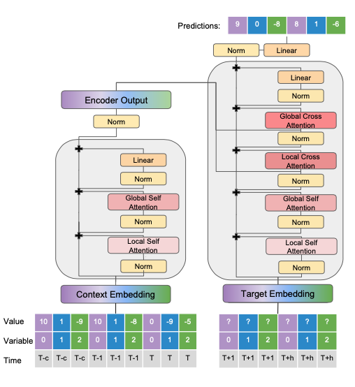

# Spacetimeformer Multivariate Forecasting

This repository contains the code for the paper, "**Long-Range Transformers for Dynamic Spatiotemporal Forecasting**", Grigsby, Wang and Qi, 2021. ([arXiv](https://arxiv.org/abs/2109.12218)). 

**Spacetimeformer** is a Transformer that learns temporal patterns like a time series model and spatial patterns like a Graph Neural Network.


**June 2022 disclaimer: the updated implementation no longer matches the arXiv pre-prints. We are working on a new version of the paper. GitHub releases mark the paper versions.**

Below we give a brief explanation of the problem and method with installation instructions. We provide training commands for high-performance results on several datasets.

## Data Format
We deal with multivariate sequence to sequence problems that have continuous inputs. The most common example is time series forecasting where we make predictions at future ("target") values given recent history ("context"):



Every model and datset uses this `x_context`, `y_context`, `x_target`, `y_target` format. X values are time covariates like the calendar datetime, while Ys are variable values. There can be additional context variables that are not predicted. 


## Spatiotemporal Attention
Typical deep learning time series models group Y values by timestep and learn patterns across time. When using Transformer-based models, this results in "temporal" attention networks that can ignore *spatial* relationships between variables.

In contrast, Graph Neural Networks and similar methods model spatial relationships with explicit graphs - sharing information across space and time in alternating layers.

Spactimeformer learns full spatiotemporal patterns between all varibles at every timestep.


We implement spatiotemporal attention with a custom Transformer architecture and embedding that flattens multivariate sequences so that each token contains the value of a single variable at a given timestep:



Spacetimeformer processes these longer sequences with a mix of efficient attention mechanisms and Vision-style "windowed" attention.



This repo contains the code for our model as well as several high-quality baselines for common benchmarks and toy datasets.


## Installation and Training
This repository was written and tested for **python 3.8** and **pytorch 1.11.0**.

```bash
git clone https://github.com/QData/spacetimeformer.git
cd spacetimeformer
conda create -n spacetimeformer python==3.8
source activate spacetimeformer
pip install -r requirements.txt
pip install -e .
```
This installs a python package called ``spacetimeformer``.


Commandline instructions for each experiment can be found using the format: ```python train.py *model* *dataset* -h```. 

#### Models
- `linear`: a basic autoregressive linear model. *New June 2022: expanded to allow for seasonal decomposition and independent params for each variable (inspired by [DLinear](https://arxiv.org/abs/2205.13504))*.
- `lstnet`: a more typical RNN/Conv1D model for multivariate forecasting. Based on the attention-free implementation of [LSTNet](https://github.com/laiguokun/LSTNet).
- `lstm`: a typical encoder-decoder LSTM without attention. We use scheduled sampling to anneal teacher forcing throughout training.
- `mtgnn`: a hybrid GNN that learns its graph structure from data. For more information refer to the [paper](https://arxiv.org/abs/2005.11650). We use the implementation from [`pytorch_geometric_temporal`](https://github.com/benedekrozemberczki/pytorch_geometric_temporal)
- `s4`: long-sequence state-space model ([paper](https://arxiv.org/abs/2111.00396)).
- `heuristic`: simple heuristics like "repeat the last value in the context sequence" as a sanity-check.
- `spacetimeformer`: the multivariate long-range transformer architecture discussed in our paper.
    - note that the "Temporal" ablation discussed in the paper is a special case of the `spacetimeformer` model. It is conceptually similar to [Informer](https://arxiv.org/abs/2012.07436). Set the `embed_method = temporal`. Spacetimeformer has many configurable options and we try to provide a thorough explanation with the commandline `-h` instructions.


#### Datasets

###### Spatial Forecasting
- `metr-la` and `pems-bay`: traffic forecasting datasets. We use a very similar setup to [DCRNN](https://github.com/liyaguang/DCRNN).
- `precip`: daily precipitation data from a latitude-longitude grid over the Continental United States. 

###### Time Series Forecasting
- `toy2`: is the toy dataset mentioned at the beginning of our experiments section. It is heavily based on the toy dataset in [TPA-LSTM](https://arxiv.org/abs/1809.04206.).
- `asos`: is the codebase's name for what the paper calls "NY-TX Weather."
- `solar_energy`: Is the codebase's name for the time series benchmark more commonly called "AL Solar."
- `exchange`: A common time series benchmark dataset of exchange rates.
- `weather`: A common time series benchmark dataset of 21 weather indiciators.
- `ettm1`: A common time series benchmark dataset of "electricity transformer temperatures" and related variables.

###### Image Completion
- `mnist`: Highlights the similarity between multivariate forecasting and vision models by completing the right side of an MNIST digit given the left side, where each row is a different variable.
- `cifar`: A harder image completion task where the variables are color channels and the sequence is flattened across rows.

###### Copy Tasks
- `copy`: Copy binary input sequences with rows shifted by varying amounts. An example of a hard task for Temporal attention that is easy for Spatiotemporal attention.
- `cont_copy`: A continuous version of the copy task with additional settings to study distribution shift.

###### "Global" or Multiseries Datasets

- `m4`: The M4 competition dataset ([overview](https://www.sciencedirect.com/science/article/pii/S0169207019301128)). Collection of 100k univariate series at various resolutions.
- `wiki`: The Wikipedia web traffic dataset from the [Kaggle competition](https://www.kaggle.com/c/web-traffic-time-series-forecasting). 145k univariate high-entropy series at a single resolution.
- `monash`: Loads the [Monash Time Series Forecasting Archive](https://arxiv.org/abs/2105.06643). Up to ~400k time univariate timeseries.

    *(We load these benchmarks in an unusual format where the context sequence is *all data up until the current time* - leading to variable length sequences with padding.)*

### Logging with Weights and Biases
We used [wandb](https://wandb.ai/home) to track all of results during development, and you can do the same by providing your username and project as environment variables:
```bash
export STF_WANDB_ACCT="your_username"
export STF_WANDB_PROJ="your_project_title"
# optionally: change wandb logging directory (defaults to ./data/STF_LOG_DIR)
export STF_LOG_DIR="/somewhere/with/more/disk/space"
```
wandb logging can then be enabled with the `--wandb` flag.

There are several figures that can be saved to wandb between epochs. These vary by dataset but can be enabled with `--attn_plot` (for Transformer attention diagrams) and `--plot` (for prediction plotting and image completion).


## Example Training Commands
Coming Soon...

## Citation
If you use this model in academic work please feel free to cite our paper

```
@misc{grigsby2021longrange,
      title={Long-Range Transformers for Dynamic Spatiotemporal Forecasting}, 
      author={Jake Grigsby and Zhe Wang and Yanjun Qi},
      year={2021},
      eprint={2109.12218},
      archivePrefix={arXiv},
      primaryClass={cs.LG}
}
```